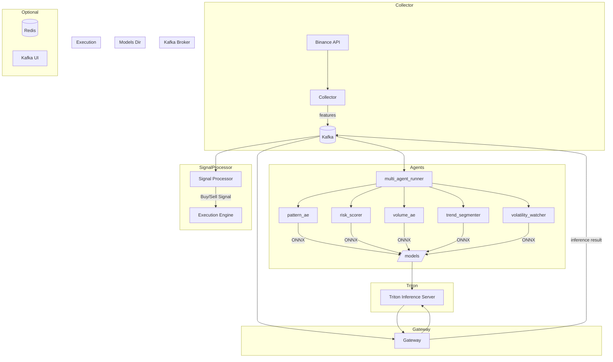

# Multi AI AGENT Quent Manager

이 서버 프로그램은 독학으로 AI, 특히 Multi AI Agent를 학습하고 구현하며 기초를 다지고,  
백엔드와 연계하기 위해 시작한 프로젝트이며 수익을 우선으로 두고 있기는 하나, 항상 수익을  
보장하는 프로그램이 아니므로 투자에 대한 모든 책임은 투자한 본인에게 귀속됩니다.

## Module

모든 모듈들은 Docker를 통해 관리됩니다. 배포 목적이 아직 없어, Kubernetes는 사용하지 않았습니다.

1. Collector : Binance API를 통해 실시간으로 데이터를 가져옵니다.
2. Agents_1M : 여러 개의 Agents로 이루어져 있으며, LLM에서 사용할 전략에 필요한 요소들을 산출합니다.
3. Agents_LLM : GPU를 사용하는 LLM Agents이며, 여러 Agents 응답을 토대로 실질적인 전략을 선택하는 Agents입니다.
4. Agents_MPC : 포지션 비율, 진입 시점, 슬리피지 등을 고려해 최적의 실행 시점과 수량을 산출하는 Agents입니다.
5. Multi_Agent_Runner : 여러 Agents들을 하나의 Container에서 동작하게 해 주는 모듈입니다.
6. Gateway : Kafka를 사용해 내부적으로 Agents끼리 빠른 통신을 하게 함으로서, 빠른 의사결정을 돕습니다.
7. Backtester : 백테스팅을 위한 모듈입니다.

## Architecture

## Settings

언어 : Python / FastApi  
가상환경 : Docker / Docker Compose  
고속 데이터프레임 처리 : Polars(Pandas의 느린 처리속도를 대체)  
멀티 AI 통신 : Redis, Kafka  
전략 조율 : LLM(LLAMA)  
추론 : triton(Agents에서 만든 ONNX 파일을 Polling 해서 사용)  
학습 : torch

## Port

## Env

Binance_Key :  
Binance_Secret :

## 실행법

1. env 파일을 생성한 후, 위에 있는 환경변수들의 Key에 맞는 Value를 입력합니다.
2. 프로젝트 Root에 models 폴더를 만들어야 합니다. Onnx가 동적으로 저장되므로, 반드시 완전히 빈 폴더여야 합니다.
3. docker-compose --env-file .env up -d --build 명령어를 통해 가상환경에서 AI를 작동시킵니다.

## 참고사항

1. GPU를 사용하기 때문에 최소한의 하드웨어가 필수입니다. (현 개발환경 : NVIDIA RTX 4060 Ti/CUDA Version: 12.6)
2. 실행법을 반드시 참고해서 설치 및 실행하시기 바랍니다.  
   최초 실행 시 vllm 컨테이너가 Hugging Face에서 모델을 다운로드하기 때문에,  
   로컬에 vllm_models 폴더가 생성되며 이는 정상 의도된 동작입니다.
