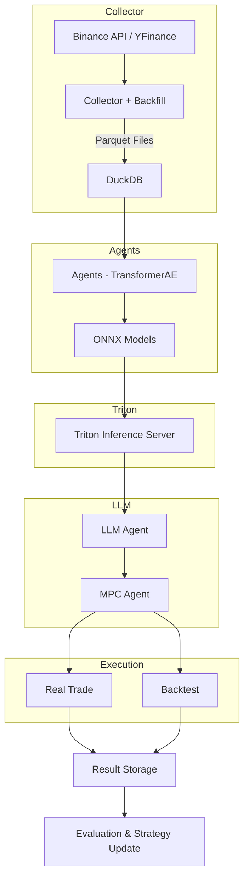

# Multi AI AGENT Quent Manager

이 서버 프로그램은 독학으로 AI, 특히 Multi AI Agent를 학습하고 구현하며 기초를 다지고,  
백엔드와 연계하기 위해 시작한 프로젝트이며 수익을 우선으로 두고 있기는 하나, 항상 수익을  
보장하는 프로그램이 아니므로 투자에 대한 모든 책임은 투자한 본인에게 귀속됩니다.

## Concept

여러 Agent에서 데이터를 기준으로 한 실시간 판단을 Kafka를 통해 Triton으로 보냅니다.  
Triton은 이를 분석하여, 추론에 대한 결과를 자체적인 LLM에 보내 평가를 받습니다.  
LLM은 이를 토대로 의사결정을 진행하며 MPC Agents에서 비율, 진입 시점 등을 고려합니다.  
이후 실제 수익률 결과를 기반으로 LLM 모델의 재학습을 통해 더 나은 투자결과를 도출해냅니다.

## Module

모든 모듈들은 Docker를 통해 관리됩니다. 배포 목적이 아직 없어, Kubernetes는 사용하지 않았습니다.

1. Collector : Binance API/Websocket, Yahoo API를 통해 실시간으로 데이터를 가져옵니다.
   과거 데이터를 backfill하여 사용하며 데이터의 의미 있는 비교 및 학습을 위해 전처리까지 한 이후
   Kafka를 이용해 Agent에 송출합니다.
2. Agents_Basket : 여러 개의 Agents를 통해 LLM에서 사용할 전략에 필요한 요소들을 산출합니다.  
   Multi_Agent_runner 컨테이너를 통해 독립적인 프로세스로 실행됩니다.
3. Agents_LLM : GPU를 사용하는 LLM Agents이며, 여러 Agents 응답을 토대로 실질적인 전략을  
   선택하는 Agents입니다.
4. Agents_MPC : 포지션 비율, 진입 시점, 슬리피지 등을 고려해 최적의 실행 시점과 수량을 산출하는 Agents입니다.
5. Multi_Agent_Runner : Agents_Basket 내의 각 Agents들을 독립적인 프로세스로 실행하는
   멀티 프로세싱 런처 역할을 합니다.
6. Triton-builder : Triton 서버에 어떻게 보내고, 추론 결과를 어떻게 처리할지 설정하는 모듈입니다.
7. Backtester : 백테스팅을 위한 모듈입니다.

## Learning & Detecting Data

1. Binance OHLCV
2. Yahoo Data(금, S&P 500, 채권)
3. Binance Orderbook

## Data Preprocessing Strategy

1. Z-score 정규화: 거래량의 경우, OHLC(open, high, low, close)에 비해 값의 스케일이 너무 크기 때문에,
   그대로 모델에 입력하면 모델이 거래량에 과도하게 민감하게 반응할 수 있어. 이를 방지하기 위해 Z-score
   정규화를 통해 모든 feature가 평균 0, 표준편차 1의 동일한 스케일을 가지도록 처리하였습니다.

## Settings

언어 : Python / FastApi  
가상환경 : Docker / Docker Compose  
고속 데이터프레임 처리 : Polars(Pandas의 느린 처리속도를 대체)  
멀티 AI 통신 : Redis, Kafka  
전략 조율 : LLM(LLAMA)  
추론 : triton(Agents에서 만든 ONNX 파일을 Polling 해서 사용)  
학습 : torch
데이터베이스 : DuckDB, Parquet(배포 예정 없음)

## Architecture

## Port

## Env

Mode :  
Binance_Key :  
Binance_Secret :

(Mode : test/prod 두 가지가 있으며, test로 설정 시 학습 사이즈를 최소한으로 설정함)

## 실행법

1. env 파일을 생성한 후, 위에 있는 환경변수들의 Key에 맞는 Value를 입력합니다.
2. 프로젝트 Root에 models 폴더를 만들어야 합니다. Onnx가 동적으로 저장되므로, 반드시 완전히 빈 폴더여야 합니다.
3. 위와 마찬가지로 데이터 저장을 위한 data 폴더를 만들어줍니다. 마찬가지로 완전히 빈 폴더여야 합니다.
4. docker-compose up -d --build 명령어를 통해 가상환경에서 AI를 작동시킵니다.

## 참고사항

1. GPU를 사용하기 때문에 최소한의 하드웨어가 필수입니다. (현 개발환경 : NVIDIA RTX 4060 Ti/CUDA Version: 12.6)
2. 실행법을 반드시 참고해서 설치 및 실행하시기 바랍니다. 최초 실행 시 vllm 컨테이너가 Hugging Face에서 모델을 다운로드하기 때문에 로컬에 vllm_models 폴더가 생성되며 이는 정상 의도된 동작입니다.
